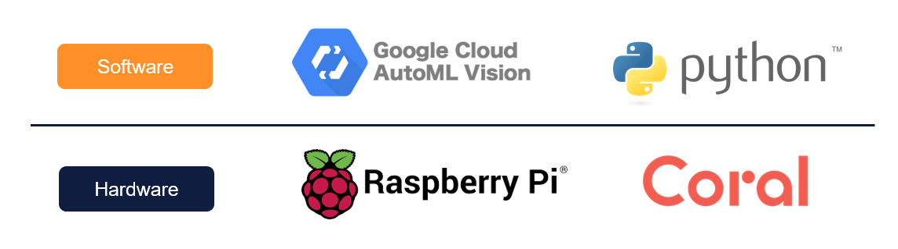
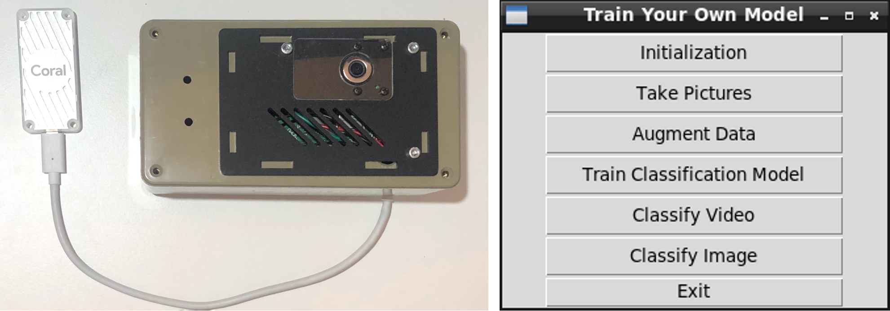

# Train Your Own Model
> This project aims at enabling end users train a custom classification model without coding skills required.

## Background
Though machine learning tehnology has penetrated everyone's life in recent years, 
approximately [0.5%](https://www.future-processing.com/blog/how-many-developers-are-there-in-the-world-in-2019)
of population know how to code, not to mention how to train a neural network. 
A smart camera system is designed here which consists of [Raspberry Pi](https://www.raspberrypi.org/),
in combination with [Google Coral TPU](https://coral.ai/products/accelerator/) with the support of
[Google Cloud AutoML Vision](https://cloud.google.com/vision/automl/docs/tutorial#tutorial-vision-dataset-python)
using python.


This smart camera system enables end users without coding skills to train their own deep learning model
for status classification tasks guided by GUI instructions.

## System overview


## Before you start
Several preparations have to be finished before you use this system.
### Hardware requirements
- Raspberry Pi 3B+ or above
- Raspberry Pi camera
- Google Coral USB Accelerator
- Monitor, keyboard(watch out for Swiss German layoout) and mouse(optional)

### Raspberry Pi setup

After login into the system via:

- username: pi
- password: rpi4pdz

Type in `sudo nano /etc/wpa_supplicant/wpa_supplicant.conf`, type `Enter` and get into the file, inside which you'll have:

```
ctrl_interface=/run/wap_supplicant
update_config=1
country=CH

network={
	ssid="YOUR_WIFI_NAME"
	psk="YOUR_WIFI_PASSWORD"
}
```

Type in the information of you private WIFI. If you're using ETH's WLAN, you should replace above codes with codes below:

```
# Copyright from Miha Zagar
ctrl_interface_group=root
ap_scan=1
eapol_version=2
update_config=0

network={
	disabled=1
	auth_alg=OPEN
	ssid="eduroam"
	scan_ssid=1
	key_mgmt=WPA-EAP
	proto=WPA RSN
	pairwise=CCMP TKIP
	eap=PEAP
	identity=		#Edit this
	anonymous_identity="anonymous@staff-ethz.ch"	#this
	password=		#and this
	phase1="peaplabel=0"
	phase2="auth=MSCHAPV2"
	priority=2
id_str="delet"
}
```

Save and Quit. type `sudo raspi-config` in the root directory `~` , 
choose `2 Network Options`, type in the required information. 
To check if the WIFI has been connected, in the `~`, 
type in `hostname -I` to see if you get a valid IP.

### Remote control
With opening your ssh software and inputting the IP you got, 
you can establish a ssh connection.

- SSH connection

Here I recommend [MobaXterm](https://mobaxterm.mobatek.net/) in which you can 
adjust font theme and transfer files easily, 
though [PuTTY](https://www.putty.org/) is good enough.

- Real VNC Viewer

Raspberry pi camera module cannot be displayed via ordinary ssh connection. 
You can use [Real VNC Viewer](https://www.realvnc.com/en/connect/download/viewer/)
to solve this problem.

### Google Cloud AutoML platform configuration (Copyright @Miha)
1. First, log into google cloud platform. You should have set up payment and the other details already. If not, contact your project supervisor.
2. Create a new project. Follow the instructions on the screen. Make sure your region is US central 1 (Iowa). 
3. Select and enable APIs. Here you choose Cloud Storage and AutoML. 
Also grant the role File Transfer Admin since you want to transfer the model back to the raspberry pi. 
4. Create a bucket by navigating to “Storage” in the Cloud Storage section of the sidebar. 
Make sure again that the region is US central 1 (Iowa). Also make sure the storage is regional. 
5. Navigate to the IAM and Admin tab and create a service account. 
The service account needs the following privileges: Google AutoML Admin and Storage upload admin. 
6. Create a key using the option provided. Select the .json option and download it. (This is the file you need to transfer to the Raspberry Pi.)

This is all you need to do on the google cloud platform.
Once this is completed, you should have the project name, the bucket name and the json file.
On the side of the raspberry pi, you should

- Edit the `.env` file: 
    a. Navigate to the program folder and type `ls -all` into the console. There should be a hidden `.env` file. 
    b. Type nano .env to modify it. 
    c. Put in the name of the json file and the project name in the respective places. 
    d. Save and quit.

**You can always find detailed information in official guide [here](https://cloud.google.com/vision/automl/docs/before-you-begin).**


